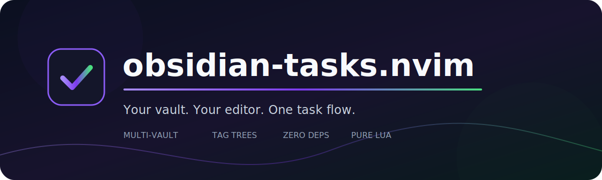

<p align="center">
  
</p>

<p align="center">
  <a href="https://github.com/jjuchara/obsidian-tasks.nvim/actions/workflows/ci.yml"></a>
  <a href="https://github.com/jjuchara/obsidian-tasks.nvim/blob/main/LICENSE"></a>
  
  
</p>

<p align="center">
  A keyboard-first task cockpit for one or many Obsidian vaults.<br>
  Your Markdown stays the source of truth.
</p>

<p align="center">
  <a href="#installation">Install</a> ·
  <a href="#configuration">Configure</a> ·
  <a href="#usage">Use</a> ·
  <a href="FUTURE.md">Roadmap</a>
</p>

---

## Why obsidian-tasks.nvim?

Keep notes in Obsidian and stay in Neovim when it is time to execute. The plugin reads ordinary Markdown checkboxes, builds an ordered tag tree, and lets you complete or create tasks without introducing a database or rewriting your vault.

| | Capability |
|---|---|
| 🗂️ | Combine multiple vaults in one view or switch repositories with tabs inside the task view |
| 🌳 | Group tasks recursively by tag order: `#work #frontend #urgent` |
| ⚡ | Complete tasks with `<Space>` and append `✅ YYYY-MM-DD` automatically |
| ✍️ | Create tasks through a guided repository, tag, start date, and deadline flow |
| 🪟 | Use a centered floating window or a regular native split |
| 🔒 | Detect stale source lines before writing and update files atomically |
| 🧩 | Run on the built-in Neovim API with no required dependencies |

## Installation

### lazy.nvim

```lua
{
  "jjuchara/obsidian-tasks.nvim",
  opts = {
    repositories = {
      {
        name = "personal",
        alias = "Personal tasks",
        path = "~/notes/personal/Tasks.md",
      },
    },
    mappings = {
      open = "<leader>to",
      create = "<leader>ta",
    },
  },
}
```

### Native packages

```sh
git clone https://github.com/jjuchara/obsidian-tasks.nvim \
  ~/.local/share/nvim/site/pack/plugins/start/obsidian-tasks.nvim
```

Then call `setup()` from your configuration.

## Configuration

The only required option is `repositories`. A repository accepts either a direct `path` to a task file or a `vault` plus a relative `todo_file`. Its optional `alias` is used as the display label while `name` remains the repository identifier.

```lua
require("obsidian-tasks").setup({
  repositories = {
    {
      name = "personal",
      alias = "Personal tasks",        -- optional display label
      path = "~/notes/personal/Tasks.md",
    },
    {
      name = "work",
      vault = "~/notes/work",
      todo_file = "Projects/Tasks.md",
    },
  },

  view = {
    type = "float",                 -- "float" or "window"
    width = 0.5,                    -- fraction of editor width
    height = 0.5,                   -- fraction of editor height
    border = "rounded",
    title = " Obsidian tasks ",
    close_on_leave = true,          -- close a float when focus leaves it
    repository_mode = "sections",  -- "sections" or "tabs"
    window_command = "botright new",
    status = "active",             -- "active", "done", or "all"
    sort = "source",               -- "source", "deadline", or "title"
  },

  dates = {
    display_format = "%d.%m.%Y",  -- strftime format used in the task view
  },

  creation = {
    default_start_today = true,
    prompt_additional_tags = true,
    infinity_marker = "♾️",
  },

  completion = {
    marker = "✅",
  },

  mappings = {
    open = "<leader>to",           -- global mapping, nil disables it
    create = "<leader>ta",         -- global mapping, nil disables it
    toggle = "<Space>",
    edit = "<CR>",
    refresh = "r",
    close = { "q", "<Esc>" },
    cycle_status = "s",
    cycle_sort = "o",
    next_repository = "<Tab>",
    previous_repository = "<S-Tab>",
  },
})
```

## Usage

### Commands

| Command | Action |
|---|---|
| `:ObsidianTasks` | Open the task view |
| `:ObsidianTasksCreate` | Start the guided creation flow |
| `:ObsidianTasksRefresh` | Reload every open task view |
| `:ObsidianTasksSort [source\|deadline\|title]` | Set sorting, or cycle it without an argument |

### Task view

| Key | Action |
|---|---|
| `<Space>` | Toggle the task under the cursor |
| `<CR>` | Open the Markdown source at the task line |
| `s` | Cycle `active → done → all` |
| `o` | Cycle `source → deadline → title` sorting |
| `r` | Refresh from disk |
| `q`, `<Esc>` | Close the view |

A floating view is modal by default: clicking another window closes it. Set `view.close_on_leave = false` if you prefer a persistent float.

### Creating a task

1. Select a repository when more than one is configured.
2. Enter the task text.
3. Select or create the primary tag.
4. Add optional tags as `gantt urgent`, `#gantt #urgent`, or `gantt, urgent`.
5. Confirm the start date and optional deadline. Enter `yesterday`, `today`, `tomorrow`, an ISO date such as `2026-07-10`, or a date matching `dates.display_format`. Leading zeroes are optional, so `7.3.2026` is accepted for `%d.%m.%Y`.

The completion notification shows the persisted tag path, for example `#work → #gantt`.
Dates are always stored as `YYYY-MM-DD`. `dates.display_format` changes rendered dates and the examples shown in creation prompts without modifying Markdown. Active tasks due today or tomorrow use `ObsidianTasksDueSoon`; overdue tasks use `ObsidianTasksOverdue`.
Deadline sorting adds virtual `#overdue`, `#due-soon`, and `#on-track` groups. `#due-soon` covers today and tomorrow; later deadlines, completed tasks, and tasks without deadlines are `#on-track`.

## Markdown format

```markdown
## #work

- [ ] Ship the release #work #frontend #urgent 📅 2026-07-10
- [x] Fix the regression #work #backend ✅ 2026-07-02
```

Tags are significant from left to right:

```text
#work
└── #frontend
    └── #urgent
        └── Ship the release
```

When a task has no inline tag, the nearest `## #tag` heading is used as a fallback. YAML frontmatter and fenced code blocks are ignored.

## Multiple repositories

`repository_mode = "sections"` renders all repositories in one buffer with repository headers. `repository_mode = "tabs"` shows repository tabs inside the task view and renders tasks from the active repository. Use `<Tab>` / `<S-Tab>` or click a tab to switch repositories.

## Development

Run the test suite without a plugin manager:

```sh
nvim --headless -u NONE -i NONE \
  "+set rtp+=$PWD" \
  "+luafile tests/run.lua" \
  +qa
```

See [CONTRIBUTING.md](CONTRIBUTING.md) for the contribution workflow and `:help obsidian-tasks` for the built-in manual.

## Status

The core workflow is usable today. Advanced queries, recurrence, live filesystem watching, and direct task editing are tracked in [FUTURE.md](FUTURE.md).

## License

[MIT](LICENSE) © 2026 jjuchara
